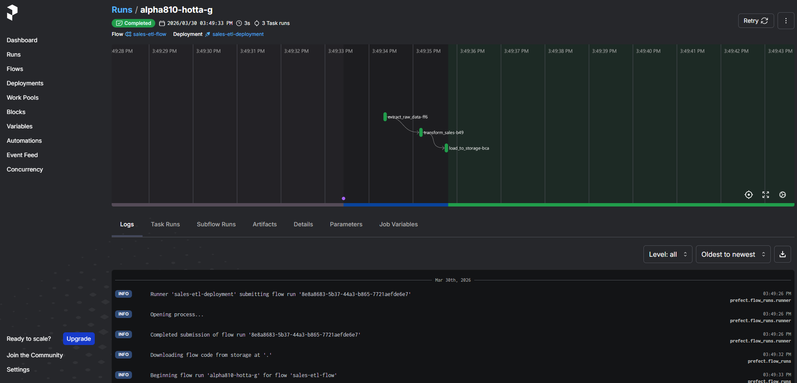

# Prefect 
export PREFECT_API_URL=http://127.0.0.1:4200/api
docker run -p 4200:4200 -d --rm prefecthq/prefect:3-python3.12 prefect server start --host 0.0.0.0
uv run 01_getting_started.py 
uv run 02_sales_etl_prefect.py 

# Screenshot

